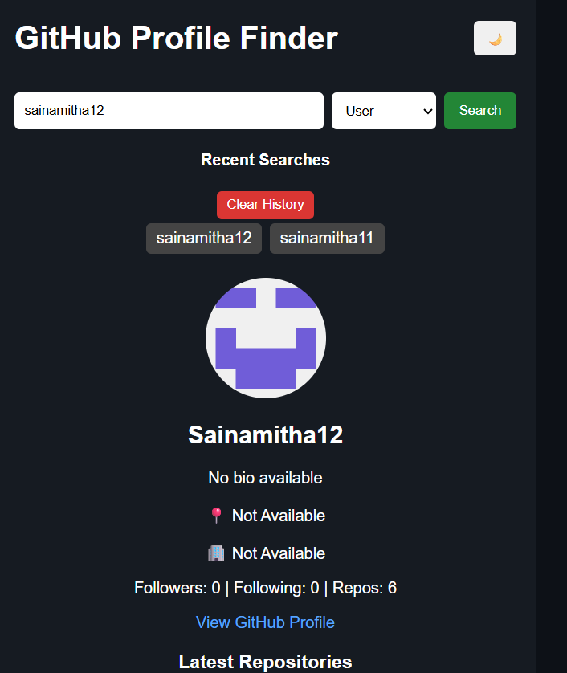
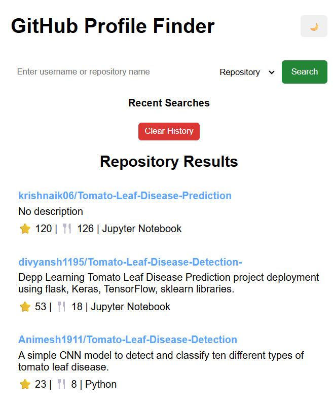

# GitHub Profile Finder

A responsive web application that allows users to search GitHub profiles and repositories using the GitHub REST API. The application provides user information, repository details, recent search history, and theme customization through a clean and interactive interface.

## Features

### User Search
- Search GitHub users by username
- Display profile picture, name, and bio
- Show followers and following count
- Display public repositories count
- Display location and company information
- View latest repositories
- Direct link to GitHub profile

### Repository Search
- Search repositories by project name
- Display repository description
- Show stars count
- Show forks count
- Display programming language
- Direct link to repository

### Additional Features
- Dark and Light Theme Toggle
- Recent Search History using Local Storage
- Clear Search History
- Loading Spinner
- Responsive Design
- API Error Handling

## Technologies Used

- HTML5
- CSS3
- JavaScript (ES6)
- GitHub REST API
- Local Storage

## Screenshots

### Home Page


### User Search



### Repository Search


### Light Mode



### Recent Searches


---

## Project Structure

```text
github-profile-finder
│
├── index.html
├── style.css
├── script.js
├── README.md
│
└── screenshots
    ├── home-page.png
    ├── user-search.png
    ├── repository-search.png
    ├── light-mode.png
    └── recent-searches.png
```

---

## How It Works

### User Search

The application fetches user information from the GitHub API:

```text
https://api.github.com/users/{username}
```

Information displayed:

- Profile Picture
- Name
- Bio
- Followers
- Following
- Public Repositories
- Location
- Company

### Repository Search

The application fetches repositories using:

```text
https://api.github.com/search/repositories?q={repository_name}
```

Information displayed:

- Repository Name
- Description
- Stars Count
- Forks Count
- Programming Language
- Repository Link

---

## Installation

### Clone Repository

```bash
git clone https://github.com/sainamitha12/github-profile-finder.git
```

### Navigate to Project Folder

```bash
cd github-profile-finder
```

### Run the Application

Open `index.html` in your browser.

---

## Learning Outcomes

This project helped in understanding:

- REST API Integration
- Fetch API
- Asynchronous JavaScript
- DOM Manipulation
- Event Handling
- Local Storage
- Responsive Web Design
- API Error Handling
- User Interface Design

---

## Future Enhancements

- GitHub Contribution Graph
- Search Suggestions
- Advanced Repository Filters
- Pagination
- Trending Repository Section
- User Contribution Statistics
- Repository Topics Support

---

## Repository Description

A responsive GitHub Profile Finder built using HTML, CSS, JavaScript and GitHub REST API. Supports user and repository search, theme switching and search history.

---

## Repository Topics

```
html
css
javascript
github-api
rest-api
frontend
web-development
responsive-design
local-storage
```

---

## Author

**Sai Namitha**
